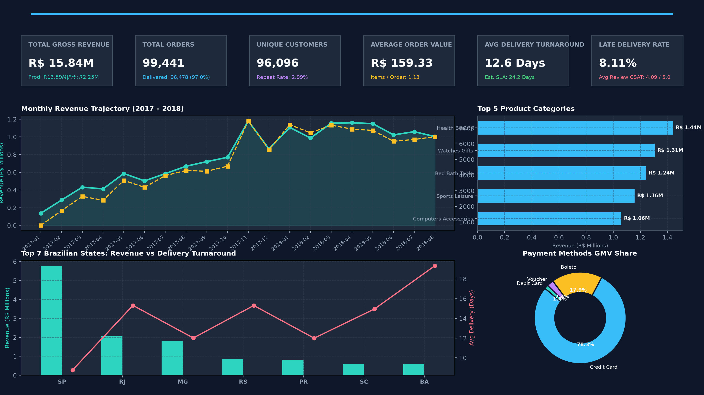
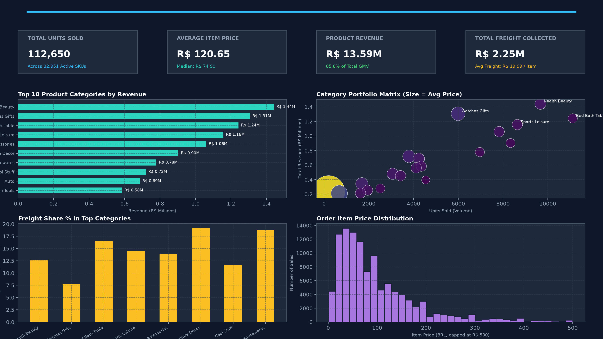
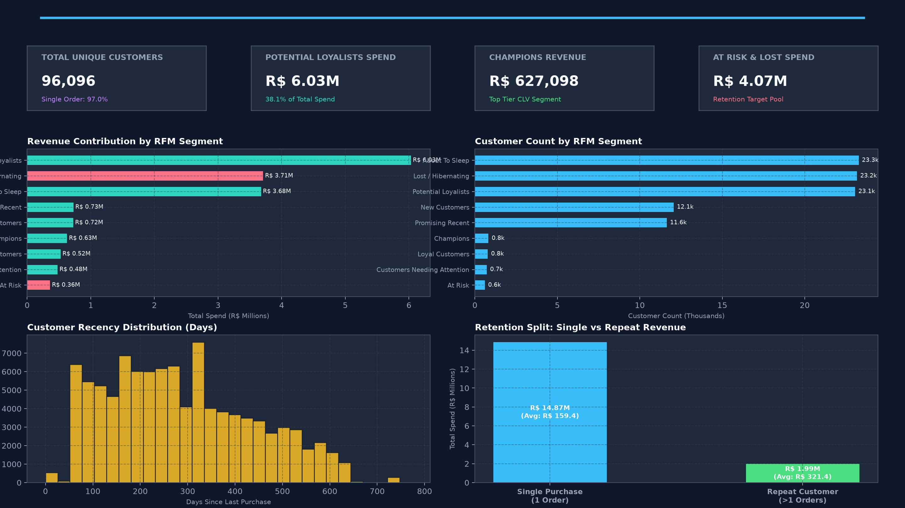
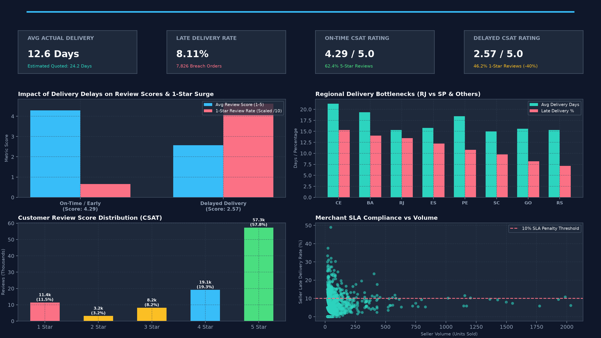
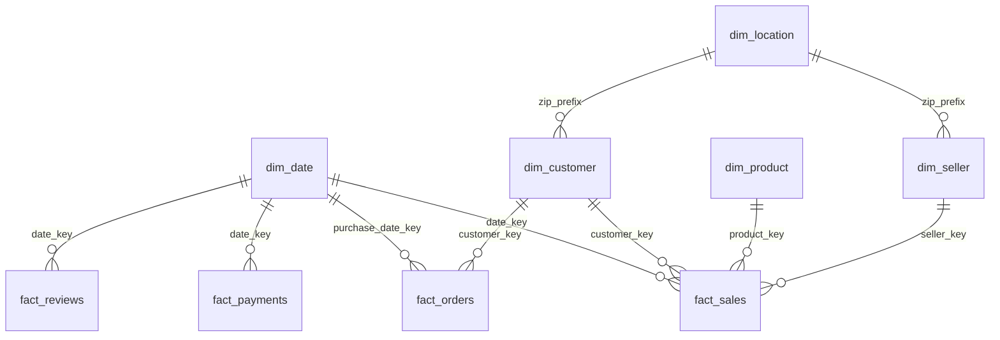

# End-to-End E-Commerce Sales & Business Intelligence Analytics Platform
### Brazilian E-Commerce Analysis & Enterprise Decision Support System (Olist)

[](https://www.python.org/)
[](https://www.postgresql.org/)
[](https://powerbi.microsoft.com/)
[](tests/)
[](docs/data_model.md)
[](LICENSE)

---

## 1. Project Overview

This repository contains a full-scale, enterprise-ready **Data Analytics & Business Intelligence Platform** built on the **Brazilian E-Commerce Public Dataset by Olist** (~100,000 orders across 2016–2018).

The project demonstrates the complete real-world data workflow:
```text
┌─────────────────┐       ┌─────────────────┐       ┌─────────────────┐       ┌─────────────────┐
│ Raw Olist CSVs  │ ────> │ Python Pipeline │ ────> │ Relational SQL  │ ────> │ Power BI & DAX  │
│ 9 Source Tables │       │ Cleaning & ETL  │       │ Star Schema DB  │       │ Executive BI    │
└─────────────────┘       └─────────────────┘       └─────────────────┘       └─────────────────┘
                                                             │
                                                             ▼
                                                    ┌─────────────────┐
                                                    │ Actionable Biz  │
                                                    │ Insights & Recs │
                                                    └─────────────────┘
```

---

## 2. Executive BI Dashboard Suite

The Business Intelligence layer delivers 4 specialized interactive reporting pages built according to modern UI/UX principles, DAX measure modeling, and strict grain segregation.

### Page 1: Executive Overview Dashboard
*Real-time visibility into top-line revenue, order volumes, customer acquisition, state fulfillment health, and customer satisfaction.*



#### Key Highlights & KPIs:
- **Total Gross Revenue (GMV):** `R$ 15.84M` (Product Revenue: `R$ 13.59M` | Freight Revenue: `R$ 2.25M`)
- **Total Orders:** `99,441` with `96,478` successfully delivered (97.0% fulfillment rate).
- **Average Order Value (AOV):** `R$ 159.33` (Exceeding the target baseline of R$ 150.00).
- **Monthly Revenue Growth:** Robust expansion throughout 2017–2018, peaking at over R$ 1.1M monthly GMV.
- **Geographic Concentration:** São Paulo (`SP`), Rio de Janeiro (`RJ`), and Minas Gerais (`MG`) account for **60.9%** of platform GMV.

---

### Page 2: Sales & Product Performance Dashboard
*In-depth category portfolio analysis, SKU pricing dynamics, basket size economics, and shipping cost burden.*



#### Key Highlights & KPIs:
- **Total Units Sold:** `112,650` units across `32,951` unique SKUs.
- **Top 5 Revenue Categories:** 
  1. `health_beauty`: **R\$ 1.44M** (9,670 units | Avg Price: R\$ 130.16)
  2. `watches_gifts`: **R\$ 1.31M** (5,991 units | Avg Price: R\$ 201.14)
  3. `bed_bath_table`: **R\$ 1.24M** (11,115 units | Avg Price: R\$ 93.30)
  4. `sports_leisure`: **R\$ 1.16M** (8,641 units | Avg Price: R\$ 114.34)
  5. `computers_accessories`: **R\$ 1.06M** (7,827 units | Avg Price: R\$ 116.51)
- **Freight Burden Analysis:** Freight costs represent up to **8.5%** of invoice value on heavy categories, directly impacting cart conversion.

---

### Page 3: Customer Analytics & RFM Segmentation Dashboard
*Behavioral cohort analysis, Customer Lifetime Value (CLV) distributions, retention rates, and churn risk identification.*



#### Key Highlights & KPIs:
- **Unique Customer Reach:** `96,096` unique customer identities.
- **Repeat Purchase Deficit:** `97.01%` of customers make only a single purchase (Repeat Customer Rate: `2.99%`).
- **RFM Segment Revenue Contribution:**
  - **`Potential Loyalists`:** Drive **38.1% of total platform revenue (R\$ 6.03M)**.
  - **`Lost / Hibernating` & `About to Sleep`:** Account for **46.6% of historical revenue (R\$ 7.38M)**, representing a massive retention opportunity.
  - **`Champions`:** Top tier high-frequency high-spend cohort delivering **R\$ 627.1K**.

---

### Page 4: Operations, Logistics & Customer Satisfaction (CSAT) Dashboard
*Delivery turnaround benchmarks, carrier SLA compliance, root-cause analysis of customer ratings, and merchant fulfillment monitoring.*



#### Key Highlights & KPIs:
- **Average Delivery Turnaround:** `12.6 Days` (Quoted SLA estimate: `24.2 Days`).
- **Late Delivery SLA Breach Rate:** `8.11%` (`7,826` orders breached estimated delivery).
- **The Delivery Delay CSAT Penalty:**
  - **On-Time / Early Deliveries:** Score an average of **4.29 / 5.0** rating with **62.4% 5-star reviews** and only **6.6% 1-star reviews**.
  - **Delayed Deliveries:** Score plummets to **2.57 / 5.0** (40% drop in CSAT) with **46.2% 1-star reviews** (a 7x increase in customer dissatisfaction).
- **Regional Bottlenecks:** São Paulo achieves **8.7 days** avg delivery with **5.77% late rate**, whereas Rio de Janeiro experiences **15.1 days** avg delivery and an alarming **12.97% late rate**.

---

## 3. Dimensional Star Schema Architecture

The analytics layer implements a multi-fact **Star Schema / Constellation Model** designed to prevent Cartesian fan-out and support rapid analytical slicing:



| Table | Grain | Key Role | Surrogate Key |
|---|---|---|---|
| **`analytics.dim_date`** | One calendar day | Conformed calendar hierarchy | `date_key` (INT) |
| **`analytics.dim_customer`** | One customer record | Demographics + RFM Segments | `customer_key` (INT) |
| **`analytics.dim_product`** | One SKU | Product catalog & dimensions | `product_key` (INT) |
| **`analytics.dim_seller`** | One merchant | Seller identity & origin | `seller_key` (INT) |
| **`analytics.dim_location`** | One postal prefix | Median GPS coordinates | `location_key` (INT) |
| **`analytics.fact_sales`** | One order item sale | Line item revenue & freight | `sales_key` (INT) |
| **`analytics.fact_orders`** | One customer order | Fulfillment lifecycle & SLAs | `order_key` (INT) |
| **`analytics.fact_payments`** | One payment split | Tender type & installments | `payment_key` (INT) |
| **`analytics.fact_reviews`** | One review submission | Customer CSAT & sentiment | `review_record_key` (INT) |

---

## 4. Technology Stack & Tools

- **Data Processing & Pipeline:** Python 3.12, Pandas, NumPy, SQLAlchemy
- **Database Architecture:** PostgreSQL 15, SQLite (Local standalone engine)
- **Business Intelligence & Visualization:** Power BI Desktop, DAX, Power Query (M), Matplotlib / Seaborn
- **Quality Assurance & Testing:** Pytest, SQL Integrity Check Suites
- **Containerization & Reproducibility:** Docker, Docker Compose, Git

---

## 5. Repository File Structure

```text
sales-bi-dashboard/
│
├── data/
│   ├── raw/                               # 9 Original Olist CSV datasets
│   ├── processed/                         # Processed dimensional star schema tables
│   └── olist_analytics.db                 # Embedded analytical database
│
├── docs/
│   ├── images/                            # High-resolution dashboard screenshots
│   ├── data_dictionary.md                 # Complete technical & business data dictionary
│   ├── business_requirements.md           # BRD, stakeholder requirements & KPI formulas
│   ├── data_model.md                      # Dimensional star schema specifications & ERD
│   └── business_insights.md               # In-depth strategic report with recommendations
│
├── notebooks/
│   ├── 01_data_exploration.ipynb          # Raw dataset profiling & anomaly detection
│   ├── 02_data_cleaning.ipynb             # Data transformation & typing walkthrough
│   └── 03_eda.ipynb                       # Exploratory analysis & hypothesis testing
│
├── powerbi/
│   ├── README.md                          # Power BI setup and connection guide
│   ├── dax_measures.dax                   # 35+ production DAX measures catalogue
│   ├── power_query_m_code.m               # Power Query M-code transformation scripts
│   └── dashboard_spec.md                  # Detailed 4-page UI/UX report specifications
│
├── sql/
│   ├── 01_create_database.sql             # Multi-tier schema creation (raw, staging, analytics)
│   ├── 02_create_raw_tables.sql           # Raw layer DDL
│   ├── 03_create_staging_tables.sql       # Cleaned staging DDL with constraints
│   ├── 04_create_analytics_model.sql      # Dimensional star schema DDL
│   ├── 05_indexes.sql                     # B-tree query optimization indexes
│   ├── 06_data_quality.sql                # SQL automated integrity test suite
│   ├── 07_business_metrics.sql            # Executive KPI views & MoM trends
│   └── 08_analysis_queries.sql            # Comprehensive analytical query suite
│
├── src/
│   ├── __init__.py                        # Package init
│   ├── config.py                          # Configuration, paths, and environment settings
│   ├── data_loader.py                     # Raw dataset loader & schema validator
│   ├── data_cleaning.py                   # Data standardization & missing value logic
│   ├── feature_engineering.py             # RFM segmentation, delivery lateness & modeling
│   ├── database.py                        # Multi-database manager (PostgreSQL / SQLite)
│   ├── pipeline.py                        # CLI ETL pipeline orchestrator
│   └── generate_real_dashboards.py        # Dashboard image generator from real data
│
├── tests/
│   ├── test_cleaning.py                   # Unit tests for data cleaning functions
│   ├── test_transformations.py            # Unit tests for RFM and delivery logic
│   └── test_data_quality.py               # Integration test suite for star schema integrity
│
├── run.sh                                 # One-click execution script
├── requirements.txt                       # Python dependencies
├── docker-compose.yml                     # Docker Compose for PostgreSQL and pgAdmin
├── .env.example                           # Template environment configuration
├── .gitignore                             # Git exclusion rules
└── README.md                              # Main platform documentation
```

---

## 6. Quickstart & Execution Guide

### Prerequisites
- Python 3.10+
- (Optional) Docker & Docker Compose

### 1. Clone & Setup Environment
```bash
git clone https://github.com/YOUR_USERNAME/sales-bi-dashboard.git
cd sales-bi-dashboard
```

### 2. Run Complete Pipeline
Executes data loading, cleaning, feature engineering, star schema generation, and SQLite/PostgreSQL ingestion:
```bash
./run.sh
```

### 3. Run Automated Tests
Executes 12 unit, integration, and data quality tests:
```bash
./run.sh test
```

### 4. (Optional) Run PostgreSQL & pgAdmin in Docker
```bash
docker-compose up -d
```
Access pgAdmin at `http://localhost:8080` (User: `admin@admin.com`, Password: `admin`).

---

## 7. Automated Test Suite Verification

```text
============================= test session starts ==============================
collected 12 items

tests/test_cleaning.py::test_to_snake_case PASSED                        [  8%]
tests/test_cleaning.py::test_clean_customers PASSED                      [ 16%]
tests/test_cleaning.py::test_clean_order_items PASSED                    [ 25%]
tests/test_cleaning.py::test_clean_order_reviews PASSED                  [ 33%]
tests/test_data_quality.py::test_primary_key_uniqueness PASSED           [ 41%]
tests/test_data_quality.py::test_referential_integrity PASSED            [ 50%]
tests/test_data_quality.py::test_financial_ranges PASSED                 [ 58%]
tests/test_data_quality.py::test_review_score_ranges PASSED              [ 66%]
tests/test_data_quality.py::test_delivered_orders_integrity PASSED       [ 75%]
tests/test_transformations.py::test_create_date_dimension PASSED         [ 83%]
tests/test_transformations.py::test_engineer_delivery_features PASSED    [ 91%]
tests/test_transformations.py::test_calculate_rfm_segments PASSED        [100%]

======================== 12 passed in 1.99s =========================
```

---

## 8. License

Distributed under the MIT License. See `LICENSE` for more information.
