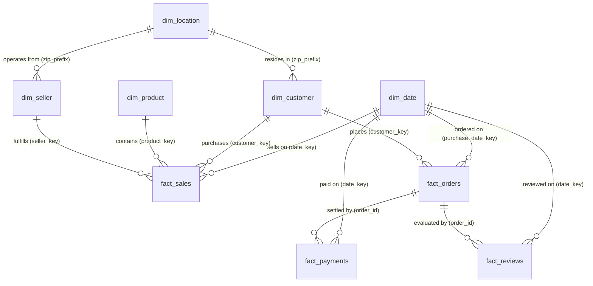

# Dimensional Data Model Architecture
## Multi-Fact Star Schema for Olist E-Commerce Analytics

---

## 1. Dimensional Architecture Overview

To support enterprise BI reporting, slice-and-dice queries, and Power BI dashboards without fan-out traps or grain confusion, the analytics layer implements a **Constellation / Multi-Fact Star Schema**.

---

## 2. Table Cardinality & Grain Specifications

| Schema Object | Grain (One row per...) | Role | Surrogate Key | Natural Key |
|---|---|---|---|---|
| **`analytics.dim_date`** | One calendar day | Conformed Dimension | `date_key` (INT) | `full_date` (DATE) |
| **`analytics.dim_customer`** | One transactional customer ID | Dimension (Demographics + RFM) | `customer_key` (INT) | `customer_id` / `customer_unique_id` |
| **`analytics.dim_product`** | One unique SKU / product | Dimension (Catalog & Physical Specs) | `product_key` (INT) | `product_id` |
| **`analytics.dim_seller`** | One marketplace merchant | Dimension (Vendor location) | `seller_key` (INT) | `seller_id` |
| **`analytics.dim_location`** | One postal code prefix | Dimension (Geospatial coordinates) | `location_key` (INT) | `geolocation_zip_code_prefix` |
| **`analytics.fact_sales`** | One order item SKU sale | Fact Table (Line Item Revenue) | `sales_key` (INT) | `order_id` + `order_item_id` |
| **`analytics.fact_orders`** | One customer order | Fact Table (Fulfillment & Delivery SLAs) | `order_key` (INT) | `order_id` |
| **`analytics.fact_payments`** | One payment split transaction | Fact Table (Payment Channels & Installments) | `payment_key` (INT) | `order_id` + `payment_sequential` |
| **`analytics.fact_reviews`** | One review submission | Fact Table (Customer CSAT & Feedback) | `review_record_key` (INT) | `review_id` + `order_id` |

---

## 3. Key Design Decisions

### 3.1 Separation of Fact Sales and Fact Orders
- **`fact_sales`** records line-item revenue, enabling granular analysis across product categories, dimensions, and sellers without aggregating across items.
- **`fact_orders`** records order-level lifecycle milestones (approval, carrier handover, final customer delivery, lateness flags, delivery duration in days) and basket-level summaries.

### 3.2 Handling Payment and Review Cardinality
In e-commerce datasets, orders can have multiple payment methods (e.g. paying part with a voucher and remainder with credit card) and occasional multiple review records. Keeping `fact_payments` and `fact_reviews` as specialized fact tables prevents Cartesian explosion during revenue calculations.

### 3.3 Postal Code Prefix Aggregation (`dim_location`)
The raw geolocation file contains over 1,000,000 GPS coordinates recorded across multiple pings. `dim_location` aggregates coordinates by postal code prefix (`geolocation_zip_code_prefix`) taking the median latitude and longitude. This reduces table footprint by **98%** (from 1,000,000 to ~19,000 rows) while preserving geospatial precision for regional mapping.
